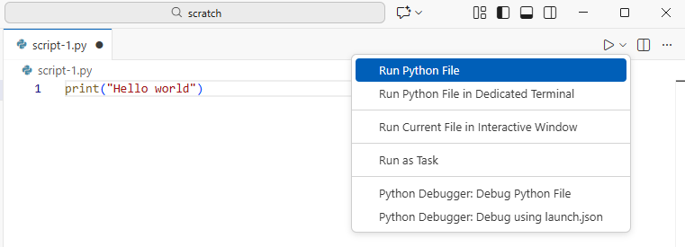
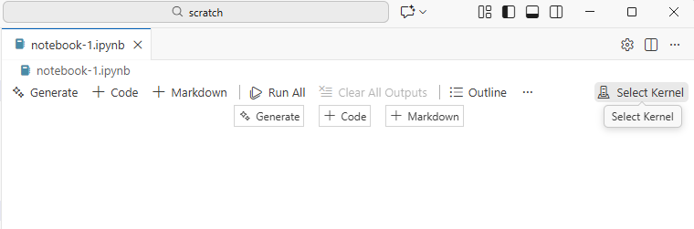
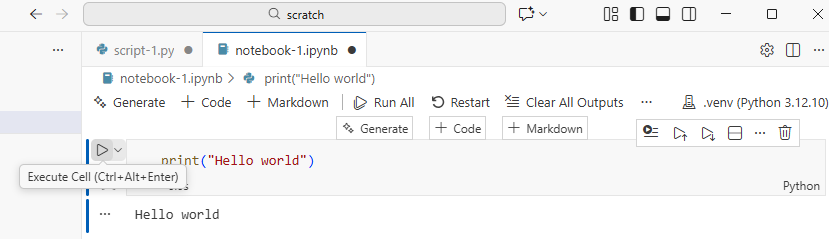

::::::::::::::::::::::::::::::::::::::: objectives

- Open a VSCode project.
- Create a Python script.
- Create a Jupyter notebook.
- Understand the difference between a Python script and a Jupyter notebook.
- Create Markdown cells in a notebook.
- Create and run Python cells in a notebook.

::::::::::::::::::::::::::::::::::::::::::::::::::

:::::::::::::::::::::::::::::::::::::::: questions

- How can I run Python programs?

::::::::::::::::::::::::::::::::::::::::::::::::::

In this workshop we will look at two options on how to run Python code: non-interactively via Python scripts and interactively via [Jupyter Notebooks][jupyter]. Jupyter notebooks are common in data science and visualization and serve as a convenient common-denominator experience for running Python code interactively where we can easily view and share the results of our Python code.

There are diverse ways of editing, managing, and running code. Software developers often use an integrated development environment (IDE) like [PyCharm](https://www.jetbrains.com/pycharm/) or [Visual Studio Code](https://code.visualstudio.com/) (VSCode), or text editors like Vim or Emacs, to create and edit their Python programs. After editing and saving your Python programs you can execute those programs within the IDE itself or directly on the command line. In this workshop we will use VSCode to explore Python scripts as well as Jupyter notebooks. In contrast to Python scripts, Jupyter notebooks let us execute and view the results of our Python code immediately within the notebook.

Jupyter notebooks have several other handy features:

- It allows you to annotate your code with links, different sized text, bullets, etc. to make it more accessible to you and your collaborators.
- It allows you to display figures next to the code that produces them
  to tell a complete story of the analysis.

Each notebook contains one or more cells that contain code, text, or images.

::::::::::::::::::::::::::::::::::::::::: callout

To learn more about the origin of Jupyter notebooks and how to use them with Jupyterlab, see the JupyterLab based version of this lesson: [Software Carpentry: Plotting and Programming with Python](https://swcarpentry.github.io/python-novice-gapminder/)

:::::::::::::::::::::::::::::::::::::::::::::::::

## Getting Started with VSCode

VSCode is an integrated development environment (IDE), with extensive features for diverse programming languages.
You can add functionality for (almost) anything using [VSCode Extensions](https://code.visualstudio.com/docs/configure/extensions/extension-marketplace).

If you have not already installed the `Python` and `Jupyter` extensions or didn't set up the VSCode workspace for this workshop, see the workshop website for install instructions.

### Setup a Python script

Open the workshop workspace in VSCode and create a `script-1.py` file. Add a line `print('Hello world')` in the file and run it using the `Run Python file` button on the top right of the VSCode window.

<p align='center'>
  
</p>

This will open an output terminal panel and display `Hello world` in it.

Congratulations! You just ran your first Python script!

### Setup a Jupyter notebook

In the VSCode workspace create a `notebook-1.ipynb` file. The extension `ipynb` is short for <b>I</b>nteractive <b>Py</br>thon <b>N</b>ote<b>b</b>ook.

<p align='center'>
  
</p>

The VSCode interface provides additional options for the jupyter notebook file in comparison to the Python script. Instead of running the file directly as a Python script, for a Jupyter notebook we need to select which Jupyter kernel we want to use to run this notebook. Click on the `Select Kernel` and select the Python environment you created in the setup for this workshop. This will start a jupyter kernel in the background, so you can execute the content of the Jupyter notebook.

To run Python code in a Jupyter notebook, add a code cell (`+Code` button) and add `print("Hello World")` into the new cell. To execute the cell, click the `Execute Cell` button or press `Ctrl+Alt+Enter`. The output is printed directly below the cell. 

<p align='center'>
  
</p>

Congratulations! You just ran your first Python command in a Jupyter notebook!

### Menu Bar

The VSCode Menu Bar has the top-level menus that expose various actions for file options and editor configuration which are useful independent of the language you are working with. In many cases those commands also come with pre-defined keyboard shortcuts indicated on the right side of the option field. A short overview of VSCode menus

- **File:** Actions related to files and directories such as *New*, *Open*, *Close*, *Save*, etc. as well as general editor settings and preferences.
- **Edit:** Actions related to editing documents and other activities such as *Undo*, *Cut*, *Copy*, *Paste*, etc.
- **View:** Actions that alter the appearance of VSCode.
- **Run:** Actions for running code in different activities such as notebooks and code consoles (discussed below).
- **Help:** A list of VSCode help links.

:::::::::::::::::::::::::::::::::::::::::  callout

## Kernels

To run code in the Jupyter notebook it is necessary to select a kernel. Here we used the Python environment we set up earliet. In general Jupyter [docs](https://jupyterlab.readthedocs.io/en/stable/user/documents_kernels.html)
define kernels as "separate processes started by the Jupyter server that runs your code in different programming languages and environments."
So when we assign the Python interpeter as kernel, that starts a kernel - a process - that is going to run the code. The kernel is not necessarily a Python process, but exist in for a number of languages. Using other Jupyter [kernels for other programming languages](https://github.com/jupyter/jupyter/wiki/Jupyter-kernels) would let us
write and execute code in other programming languages in the same JupyterLab interface, like R, Java, Julia, Ruby, JavaScript, Fortran, etc.

::::::::::::::::::::::::::::::::::::::::::::::::::


:::::::::::::::::::::::::::::::::::::::::  callout

## How It's Stored

- The notebook file is stored in a format called JSON.
- Just like a webpage, what's saved looks different from what you see in your browser.
- But this format allows Jupyter to mix source code, text, and images, all in one file.
  

::::::::::::::::::::::::::::::::::::::::::::::::::


:::::::::::::::::::::::::::::::::::::::::  callout

## Code vs. Text

Jupyter notebooks mix code and text in different types of blocks, called cells. We often use the term "code" to mean "the source code of software written in a language such as Python".
A "code cell" in a Notebook is a cell that contains software;
a "text cell" is one that contains ordinary prose written for human beings.


## The Notebook has Command and Edit modes.

- If you press <kbd>Esc</kbd> and <kbd>Return</kbd> alternately, the outer border of your code cell will change from highlighting the cell itself to highlighting the cell content.
- These are the **Command** (cell) and **Edit** (content) modes of your notebook.
- Command mode allows you to edit notebook-level features, and Edit mode changes the content of cells.
- When in Command mode (esc/gray),
  - The <kbd>b</kbd> key will make a new cell below the currently selected cell.
  - The <kbd>a</kbd> key will make one above.
  - The <kbd>x</kbd> key will delete the current cell.
  - The <kbd>z</kbd> key will undo your last cell operation (which could be a deletion, creation, etc).
- All actions can be done using the menus, but there are lots of keyboard shortcuts to speed things up.


### Use the keyboard and mouse to select and edit cells.

- Pressing the <kbd>Return</kbd> key turns the border blue and engages Edit mode, which allows
  you to type within the cell.
- Because we want to be able to write many lines of code in a single cell,
  pressing the <kbd>Return</kbd> key when in Edit mode (blue) moves the cursor to the next line
  in the cell just like in a text editor.
- We need some other way to tell the Notebook we want to run what's in the cell.
- Pressing <kbd>Shift</kbd>\+<kbd>Return</kbd> together will execute the contents of the cell.
- Notice that the <kbd>Return</kbd> and <kbd>Shift</kbd> keys on the right of the keyboard are
  right next to each other.

### The Notebook will turn Markdown into pretty-printed documentation.

- Notebooks can also render [Markdown][markdown].
  - A simple plain-text format for writing lists, links, and other things that might go into a web page.
  - Equivalently, a subset of HTML that looks like what you'd send in an old-fashioned email.
- Turn the current cell into a Markdown cell by entering the Command mode (<kbd>Esc</kbd>/gray)
  and press the <kbd>M</kbd> key.
- `In [ ]:` will disappear to show it is no longer a code cell and you will be able to write in
  Markdown.
- Turn the current cell into a Code cell by entering the Command mode (<kbd>Esc</kbd>/gray) and
  press the <kbd>y</kbd> key.

### Markdown does most of what HTML does.

Table: Showing some markdown syntax and its rendered output.

+---------------------------------------+------------------------------------------------+
| Markdown code                         | Rendered output                                |
+=======================================+================================================+
+---------------------------------------+------------------------------------------------+
| ```                                   | <p></p>                                        |
| *   Use asterisks                     | -   Use asterisks                              |
| *   to create                         | -   to create                                  |
| *   bullet lists.                     | -   bullet lists.                              |
| ```                                   |                                                |
+---------------------------------------+------------------------------------------------+
+---------------------------------------+------------------------------------------------+
| ```                                   | <p></p>                                        |
| 1.   Use numbers                      | 1.   Use numbers                               |
| 1.   to create                        | 2.   to create                                 |
| 1.   numbered lists.                  | 3.   numbered lists.                           |
| ```                                   |                                                |
+---------------------------------------+------------------------------------------------+
+---------------------------------------+------------------------------------------------+
| ```                                   | <p></p>                                        |
| *  You can use indents                | - You can use indents                          |
|   *  To create sublists               |   - To create sublists                         |
|   *  of the same type                 |   - of the same type                           |
| *  Or sublists                        | - Or sublists                                  |
|   1. Of different                     |   1. Of different                              |
|   1. types                            |   2. types                                     |
| ```                                   |                                                |
+---------------------------------------+------------------------------------------------+
+---------------------------------------+------------------------------------------------+
| ```                                   | <p></p>                                        |
| # A Level-1 Heading                   | ## A Level-1 Heading                           |
| ```                                   |                                                |
+---------------------------------------+------------------------------------------------+
+---------------------------------------+------------------------------------------------+
| ```                                   | <p></p>                                        |
| ## A Level-2 Heading (etc.)           | ### A Level-2 Heading (etc.)                   |
| ```                                   |                                                |
+---------------------------------------+------------------------------------------------+
+---------------------------------------+------------------------------------------------+
| ```                                   | <p></p>                                        |
| Line breaks                           | Line breaks                                    |
| don't matter.                         | don't matter.                                  |
|                                       |                                                |
| But blank lines                       | But blank lines                                |
| create new paragraphs.                | create new paragraphs.                         |
| ```                                   |                                                |
+---------------------------------------+------------------------------------------------+
+---------------------------------------+------------------------------------------------+
| ```                                   | <p></p>                                        |
| [Links](http://software-carpentry.org)| [Links](https://software-carpentry.org)        |
| are created with `[...](...)`.        | are created with `[...](...)`.                 |
| Or use [named links][data-carp].      | Or use [named links][data_carpentry].          |
|                                       |                                                |
| [data-carp]: http://datacarpentry.org |                                                |
| ```                                   |                                                |
+---------------------------------------+------------------------------------------------+


:::::::::::::::::::::::::::::::::::::::  challenge

## Creating Lists in Markdown

Create a nested list in a Markdown cell in a notebook that looks like this:

1. Get funding.
2. Do work.
  - Design experiment.
  - Collect data.
  - Analyze.
3. Write up.
4. Publish.

:::::::::::::::  solution

## Solution

This challenge integrates both the numbered list and bullet list.
Note that the bullet list is indented 2 spaces so that it is inline with the items of the numbered list.

```
1.  Get funding.
2.  Do work.
    *   Design experiment.
    *   Collect data.
    *   Analyze.
3.  Write up.
4.  Publish.
```

:::::::::::::::::::::::::

::::::::::::::::::::::::::::::::::::::::::::::::::

:::::::::::::::::::::::::::::::::::::::  challenge

## More Math

What is displayed when a Python cell in a notebook
that contains several calculations is executed?
For example, what happens when this cell is executed?

```python
7 * 3
2 + 1
```

:::::::::::::::  solution

## Solution

Python returns the output of the last calculation.

```python
3
```

:::::::::::::::::::::::::

::::::::::::::::::::::::::::::::::::::::::::::::::

:::::::::::::::::::::::::::::::::::::::  challenge

## Change an Existing Cell from Code to Markdown

What happens if you write some Python in a code cell
and then you switch it to a Markdown cell?
For example,
put the following in a code cell:

```python
x = 6 * 7 + 12
print(x)
```

And then run it with <kbd>Shift</kbd>\+<kbd>Return</kbd> to be sure that it works as a code cell.
Now go back to the cell and use <kbd>Esc</kbd> then <kbd>m</kbd> to switch the cell to Markdown
and "run" it with <kbd>Shift</kbd>\+<kbd>Return</kbd>.
What happened and how might this be useful?

:::::::::::::::  solution

## Solution

The Python code gets treated like Markdown text.
The lines appear as if they are part of one contiguous paragraph.
This could be useful to temporarily turn on and off cells in notebooks that get used for multiple purposes.

```python
x = 6 * 7 + 12 print(x)
```

:::::::::::::::::::::::::

::::::::::::::::::::::::::::::::::::::::::::::::::

:::::::::::::::::::::::::::::::::::::::  challenge

## Equations

Standard Markdown (such as we're using for these notes) won't render equations,
but the Notebook will.
Create a new Markdown cell
and enter the following:

```
$\sum_{i=1}^{N} 2^{-i} \approx 1$
```

(It's probably easier to copy and paste.)
What does it display?
What do you think the underscore, `_`, circumflex, `^`, and dollar sign, `$`, do?

:::::::::::::::  solution

## Solution

The notebook shows the equation as it would be rendered from LaTeX equation syntax.
The dollar sign, `$`, is used to tell Markdown that the text in between is a LaTeX equation.
If you're not familiar with LaTeX,  underscore, `_`, is used for subscripts and circumflex, `^`, is used for superscripts.
A pair of curly braces, `{` and `}`, is used to group text together so that the statement `i=1` becomes the subscript and `N` becomes the superscript.
Similarly, `-i` is in curly braces to make the whole statement the superscript for `2`.
`\sum` and `\approx` are LaTeX commands for "sum over" and "approximate" symbols.


:::::::::::::::::::::::::

::::::::::::::::::::::::::::::::::::::::::::::::::

[jupyterlab]: https://jupyterlab.readthedocs.io/en/stable/
[markdown]: https://en.wikipedia.org/wiki/Markdown
[data_carpentry]: https://datacarpentry.org


:::::::::::::::::::::::::::::::::::::::: keypoints

- Python scripts are plain text files.
- Use the Jupyter Notebook for editing and running Python.
- The Notebook has Command and Edit modes.
- Use the keyboard and mouse to select and edit cells.
- The Notebook will turn Markdown into pretty-printed documentation.
- Markdown does most of what HTML does.

::::::::::::::::::::::::::::::::::::::::::::::::::


